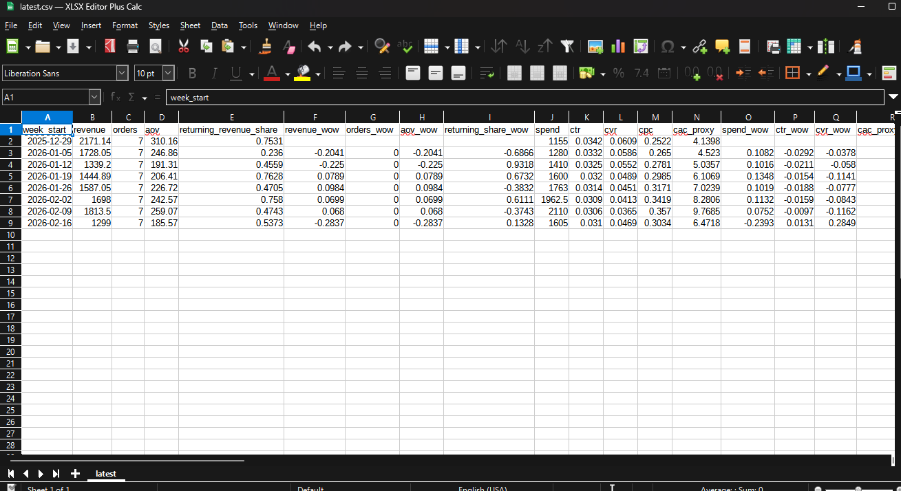

# Automated Weekly Ecommerce Reporting Pipeline

This project is a take-home submission.
It automates a weekly ecommerce performance report by pulling data from two sources, cleaning messy inputs, calculating KPIs and anomalies, generating an executive summary with Groq, and writing shareable report files on a schedule.

## What This Project Does

Every week, the pipeline:

1. Reads order data and ad performance data
2. Cleans messy dates, channel names, and currency formats
3. Calculates weekly business and marketing metrics
4. Flags unusual changes with clear rules
5. Uses a Groq-hosted LLM to write a human-readable executive summary
6. Saves the results as Markdown, CSV, and JSON files

This is built to demonstrate automation and reporting workflow quality, not to rely on perfect real-world data.

## Example Outputs 

Each run writes files into `reports/`:

- `reports/latest.md`: latest executive-ready summary (human-readable)
- `reports/latest.csv`: latest weekly KPI table (spreadsheet-friendly)
- `reports/metrics_YYYY-MM-DD.json`: full structured metrics payload
- `reports/weekly_report_YYYY-MM-DD.md`: dated summary snapshot
- `reports/weekly_report_YYYY-MM-DD.csv`: dated KPI table snapshot

### What the CSV Contains

The CSV output (`latest.csv` / dated CSV) contains one row per week and includes:

- Sales metrics: `revenue`, `orders`, `aov`, returning revenue share
- Marketing metrics: `spend`, `ctr`, `cvr`, `cpc`, `cac_proxy`
- Efficiency metrics: `mer`, channel-level `roas_*`
- WoW change columns (for sales/marketing/efficiency KPIs)
- Anomaly columns: `anomaly_count`, `anomaly_rules`
- Channel breakdown columns for revenue/spend/ROAS (e.g. `revenue_paid_social`, `spend_search`, `roas_email`)

### CSV Output Overview 





## How It Works 

```text
Orders CSV (local, messy) -----> extract.py -----> transform.py -----> metrics.py -----> llm_summary.py -----> deliver.py
Ads CSV (HTTP or local fallback) --^                 |                   |                (Groq or fallback)    |
                                                      +-------------------+----------------------------------------+
                                                                                             run.py (orchestrator)
```

Module responsibilities:

- `src/extract.py`: loads orders locally and fetches ads CSV from URL (with local fallback)
- `src/transform.py`: cleans/normalizes dates, channels, money, and numeric fields
- `src/metrics.py`: computes weekly KPIs, WoW changes, ROAS/MER, and anomaly rules
- `src/llm_summary.py`: calls Groq (OpenAI-compatible SDK) and falls back to deterministic summary if needed
- `src/deliver.py`: writes Markdown, CSV, and JSON outputs to `reports/`
- `src/run.py`: orchestrates the full pipeline end-to-end

## Data Sources and Cleanup

This implementation uses 2 sources:

1. `data/orders_messy.csv` (required messy source)
2. Ads CSV from `ADS_CSV_URL` (HTTP) with fallback to `data/ads_spend_messy.csv`

### Orders Cleanup

The orders source is intentionally messy and requires cleanup before it is usable:

- Mixed date formats are parsed safely
- Channel names are normalized to a shared canonical set
- Revenue strings are parsed from US/EU formats into floats
- Missing `customer_type` values are filled with `unknown`
- Duplicate `order_id` rows are removed (`keep='last'`)
- Invalid / missing dates are dropped

Before/after examples:

- Dates:
  - `2026-02-01`, `01/02/2026`, `Feb 1 2026`, `2026/02/01` -> parsed into normalized dates
- Channel names:
  - `fb`, `Facebook`, `Face Book`, `IG`, `instagram`, `tiktok` -> `paid_social`
  - `google ads`, `google_search` -> `search`
  - `newsletter`, `email` -> `email`
- Revenue:
  - `$1,234.50` -> `1234.50`
  - `€980,30` -> `980.30`
  - `1.500,00` -> `1500.00`
  - blank / `null` -> `0.0`

### Ads Cleanup

Ads data also gets light cleanup:

- Date parsing
- Shared channel normalization
- Numeric coercion for `spend`, `impressions`, `clicks`, `conversions`
- Missing numeric values default to `0`
- If `ADS_CSV_URL` is missing/fails, the pipeline falls back to local sample ads data

## Metrics and Anomalies

Weekly buckets are Monday-start.

### Core Metrics

- Sales: revenue, orders, AOV, customer-type revenue split, revenue by channel
- Marketing: spend, CTR, CVR, CPC, CAC proxy
- Efficiency: channel ROAS and MER
- WoW changes for major KPIs

### Anomaly Rules

The pipeline flags anomalies when:

- Revenue WoW absolute change >= `10%`
- Any channel revenue WoW absolute change >= `15%`
- Spend WoW absolute change >= `15%`
- ROAS WoW drop >= `20%` (relative)
- Returning revenue share change >= `8 percentage points`

Each anomaly includes the triggered rule and supporting numbers.

## How To Run Locally

### 1) Create and activate a virtual environment

```powershell
python -m venv .venv
.\.venv\Scripts\Activate.ps1
```

### 2) Install dependencies

```powershell
pip install -r requirements.txt
```

### 3) Configure environment variables

Create `.env` from `.env.example`:

```env
GROQ_API_KEY=your_groq_key_here
ADS_CSV_URL=https://example.com/raw/ads.csv   # optional
```

Notes:

- `.env.example` is a committed template
- `.env` is local-only and should not be committed
- `GROQ_API_KEY` enables the LLM summary via Groq
- If Groq is unavailable, the pipeline still writes a deterministic fallback summary

### 4) Run the pipeline

```powershell
python src/run.py
```

Expected outputs:

- `reports/weekly_report_YYYY-MM-DD.md`
- `reports/latest.md`
- `reports/weekly_report_YYYY-MM-DD.csv`
- `reports/latest.csv`
- `reports/metrics_YYYY-MM-DD.json`

## Scheduling (GitHub Actions)

Workflow file: `.github/workflows/weekly.yml`

Triggers:

- Scheduled run every Monday at `09:00 UTC` (`cron: 0 9 * * 1`)
- Manual run via `workflow_dispatch`

GitHub Actions secrets:

- Required: `GROQ_API_KEY`
- Optional: `ADS_CSV_URL`

## Requirement Checklist

| Requirement | How this project meets it |
|---|---|
| Use 2+ data sources | Orders CSV + Ads CSV (HTTP source with local fallback) |
| At least one source requires cleanup/transformation | `orders_messy.csv` is heavily cleaned (dates, channels, revenue, duplicates, missing values) |
| Run through an LLM to generate a human-readable summary | Groq API via OpenAI-compatible Python SDK in `src/llm_summary.py` |
| Highlight anomalies | Rule-based anomaly detection in `src/metrics.py` with supporting values |
| Deliver output automatically on a schedule | GitHub Actions weekly cron + manual dispatch; writes report files to `reports/` |

## Notes / Limitations

- Uses sample/mock data for demonstration (the focus is the pipeline design and automation)
- Currency formats are normalized, but currencies are not converted
- CSV output is an analyst-friendly tabular artifact; Markdown is the executive summary
- Groq prompt payload is compacted to avoid token-limit errors while preserving key metrics/anomalies

## Technical Notes

### Groq Integration

```python
from openai import OpenAI
client = OpenAI(
    base_url="https://api.groq.com/openai/v1",
    api_key=os.getenv("GROQ_API_KEY"),
)
```

Model used:

- `openai/gpt-oss-120b`

### Reliability / Defensive Handling

- Logging is used across modules (`INFO`, `WARNING`, `ERROR`)
- Ads data source falls back URL -> local file -> empty dataset safely
- Division-by-zero safe metric calculations
- Missing Groq key / API failure still produces a report

## Project Structure

```text
reporting-pipeline/
  data/
    orders_messy.csv
    ads_spend_messy.csv
  docs/
    images/
      .gitkeep
      csv-output-overview.png      # add this screenshot
  src/
    extract.py
    transform.py
    metrics.py
    llm_summary.py
    deliver.py
    run.py
  reports/
    .gitkeep
  .github/workflows/weekly.yml
  requirements.txt
  .env.example
  README.md
```
